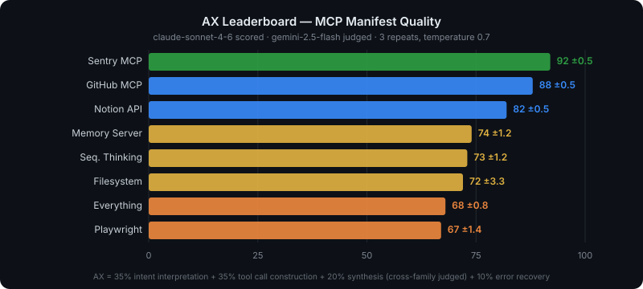

# AX Leaderboard

<!-- LEADERBOARD:START -->

| # | Server | AX Score | Intent | Tool Calls | Synthesis | Error Rec. | Coverage | Scored |
|---|--------|:--------:|:------:|:----------:|:---------:|:----------:|:--------:|--------|
| 1 | **Sentry MCP** | **92** ±0.5 | 96% | 100% | 81% | 76% | 22/22 | 2026-06-09 |
| 2 | **GitHub MCP** | **88** ±0.5 | 88% | 100% | 76% | 71% | 20/26 | 2026-06-09 |
| 3 | **Notion API** | **82** ±0.5 | 78% | 89% | 80% | 75% | 22/22 | 2026-06-09 |
| 4 | **Memory Server** | **74** ±1.2 | 65% | 98% | 46% | 69% | 9/9 | 2026-06-09 |
| 5 | **Seq. Thinking** | **73** ±1.2 | 79% | 100% | 43% | 13% | 1/1 | 2026-06-09 |
| 6 | **Filesystem** | **72** ±3.3 | 56% | 86% | 70% | 81% | 13/14 | 2026-06-09 |
| 7 | **Everything** | **68** ±0.8 | 75% | 67% | 66% | 53% | 13/13 | 2026-06-09 |
| 8 | **Playwright** | **67** ±1.4 | 61% | 64% | 89% | 57% | 23/23 | 2026-06-09 |

<!-- LEADERBOARD:END -->

Public leaderboard for **AX** — scoring the MCP tool surface, not the implementation.

AX scores an MCP server's **manifest** (tool names, descriptions, input/output schemas) by
exposing those tools to a model, intercepting every tool call, and returning a synthetic mock
response. The score reflects manifest quality — how well a model can interpret intent, select the
right tool, fill parameters, and synthesize the result — reproducibly and without a live server.

## What's here

- `data/scores/SCHEMA.md` — the **frozen** score-file schema (`schemaVersion: 2`).
- `data/scores/*.json` — one score file per server, pushed by the engine.
- `data/models.json` — the model matrix.
- `data/manifests/` — submitted manifests (no live server required to get on the board).

## Methodology (summary)

Three questions, in order: (1) **intent interpretation** — right tool, or correctly nothing for a
distractor; (2) **tool call construction** — correct name, complete and correctly-typed params;
(3) **result synthesis** — a correct, useful answer given a plausible mock response. The first two
are scored programmatically; the third by an LLM judge. The mock executor controls the response,
so error recovery and result synthesis are tested across success / empty / partial / error
variants every run.

> Scores use cross-family isolation: `claude-sonnet-4-6` is the scored model and `gemini-2.5-flash`
> generates intents and judges synthesis — so the 20% synthesis sub-score is not self-graded.
> Each server is scored over 3 repeats at temperature 0.7; the reported score is mean ± σ.

## Submit your manifest

Open a PR adding your manifest JSON to `data/manifests/`, or use the issue template. No live server
required.
